<style scoped>
  section h2 {
      margin-bottom: 0;
  }
  section h3 {
      margin-top: 0;
  }
</style>

## Sansan アプリで学ぶ iOS 13 対応

### After iOSDC JAPAN 2019

Sansan 株式会社 Sansan 事業部 プロダクト開発部
中川 泰夫

---

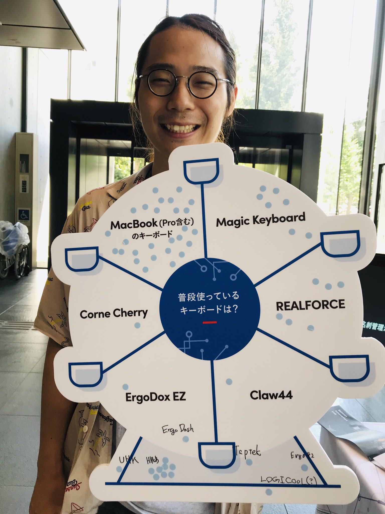

# 自己紹介

- iOSDC で Sansan ブースでキーボードの質問していたおじさん


---

# アジェンダ

1. 何故やるのか？
1. Sansan アプリを iOS 13 上で実行出来るようになるまでに起こった問題
1. Sansan アプリを iOS 13 上で実行出来るようになった後に起こった問題
1. まとめ

---

# 何故やるのか？

---

# 何故やるのか？


---

# 何故やるのか？

Starting April 2020, all new app updates will neet to be built with the iOS 13 SDK and support the all-screen design of iPhone Xs Max or later.
(2020年4月以降、新規Appと、AppのアップデートのすべてをiOS 13 SDKでビルドし、iPhone XS Max以降のオールスクリーンデザインをサポートする必要があります。)

---

### Sansan アプリを iOS 13 上で実行出来るようになるまでに起こった問題

---

# iOS 13 SDK 対応に向けて

1. macOS Catalina Beta にアップデート
2. Xcode 11 をダウンロード
3. iOS 13 SDK でビルドしてみる

---

<style scoped>
  section li {
      color: silver;
  }
  section li:last-child {
      color: black;
  }
</style>

# iOS 13 SDK 対応に向けて

1. macOS Catalina Beta にアップデート
1. Xcode 11 をダウンロード
1. iOS 13 SDK でビルドしてみる

---

# iOS 13 SDK でビルドしてみる

# ⌘+B

---

# iOS 13 SDK でビルドしてみる

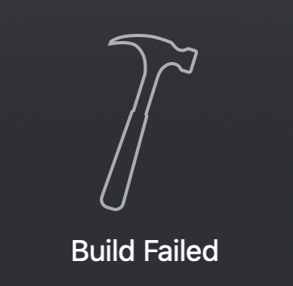

---

# iOS 13 SDK でビルドしてみる

:x: Module compiled with Swift 5.0 cannot be imported by the Swift 5.1 compiler:

---

##### Swift 5.0 でコンパイル済みのモジュールを import できない

- Sansan アプリでは Carthage でビルド済みバイナリを
コード管理することでビルド時間の短縮をしていた
- 以前にコンパイルしたのは Swift 5.0 対応時

---

##### Swift 5.0 でコンパイル済みのモジュールを import できない

<style scoped>
  section ul {
    list-style-type: none;
  }

  section li {
      font-size: 30px;
      margin-bottom: 30px;
  }
</style>

- :heavy_dollar_sign: `sudo xcode-select --switch /Applications/Xcode_11.app/Contents/Developer`
- :heavy_dollar_sign: `carthage update --platform iOS --no-use-binaries`

---

##### Swift 5.0 でコンパイル済みのモジュールを import できない

:x: *** Building scheme "XLActionController" in XLActionController.xcworkspace
Build Failed

---

##### XLActionController が Swift 5.1 でコンパイルできない

<style scoped>
  section li {
      font-size: 30px;
  }
</style>

- ビルドログを見ると、 `/XLActionController/Resource/ActionCell.xib` が
コンパイル出来ていない模様
- master ブランチに対して Xcode 11 beta 5 でビルドできるようにする
修正の PR がマージ済み
  - https://github.com/xmartlabs/XLActionController/pull/123

---

##### XLActionController が Swift 5.1 でコンパイルできない

```diff
Cartfile
---
- github "xmartlabs/XLActionController" == 5.0.0
+ github "xmartlabs/XLActionController" "master"
```

---

##### XLActionController が Swift 5.1 でコンパイルできない

<style scoped>
  section ul {
    list-style-type: none;
  }

  section li {
      font-size: 30px;
  }
</style>

- :heavy_dollar_sign: `carthage update --platform iOS --no-use-binaries`

###  :white_check_mark: Build Succeeded

---

##### Swift 5.0 でコンパイル済みのモジュールを import できない

# ⌘+B

---

##### Swift 5.0 でコンパイル済みのモジュールを import できない

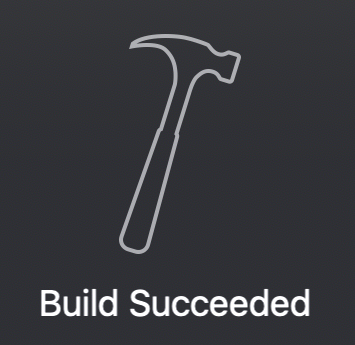

---

#### アプリを動かしてみる on iOS SDK 13

# ⌘+R

---

#### アプリを動かしてみる on iOS SDK 13

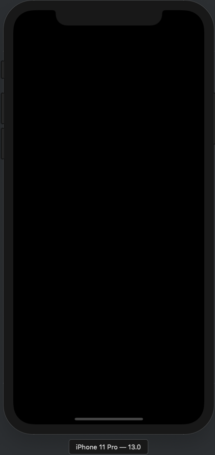

---

#### アプリを動かしてみる on iOS SDK 13

<style scoped>
  section pre {
    white-space: pre-wrap;
  }
</style>

```
2019-09-22 17:26:41.737974+0900 Sansan[32738:933703] *** Terminating app due to uncaught exception 'RLMException', reason: 'Primary key property 'id' does not exist on object 'User''
```

---

###### Realm のプライマリーキープロパティがオブジェクトに存在しない

- v3.18.0 にて Xcode 11 での互換性が追加されていた :cool:
  - コミットログを見るに Swift 5.1 で明示的に String 型のインスタンス変数名が設定されなくなったために、 Primary key property を String 型で定義していた場合にパースできず、例外が発生する模様 (User オブジェクトの id プロパティは String 型だった)

---

###### Realm のプライマリーキープロパティがオブジェクトに存在しない

<style scoped>
  section ul {
    list-style-type: none;
  }

  section li {
      font-size: 30px;
  }
</style>


```diff
Cartfile
---
- github "realm/realm-cocoa" == 3.15.0
+ github "realm/realm-cocoa" == 3.18.0
```

- :heavy_dollar_sign: `carthage update  --platform iOS --no-use-binaries`

### ⌘+R

---

# :tada:

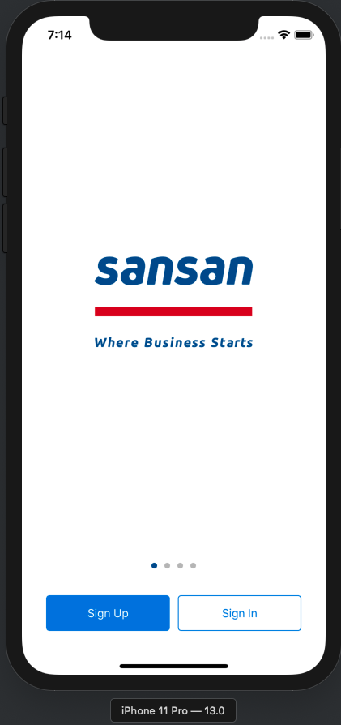

---

### Sansan アプリを iOS 13 上で実行出来るようになった後に起こった問題

---

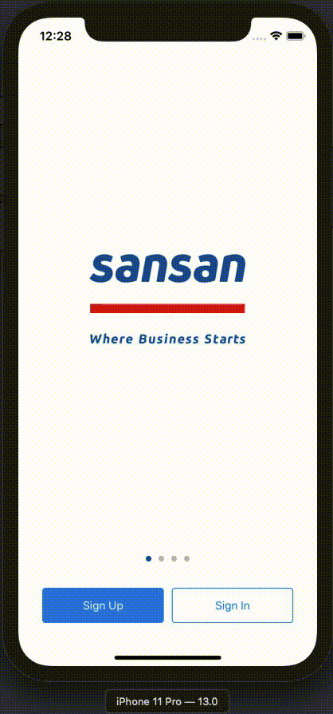

# Modal on Modal でナビゲーションバーの初回表示がおかしくなる

---

###### Modal on Modal でナビゲーションバーの初回表示がおかしくなる

- 初回表示の View Hierarchy を見ると、 UINavigationBar の高さは 56
- しかし、内部の _UIBarBackground や _UINavigationBarContentView の高さは 44
- この両者の差分、 12 が余白となって表示されてしまう
- 2 回目以降はすべて 56 で同じ

---

###### Modal on Modal でナビゲーションバーの初回表示がおかしくなる

- 試してみたのは以下
  - UINavigationBar の BarTint と同じ色を Background に設定して、ごまかす
    - ナビゲーションバーの影がない場合にしか有効でない
  - なんとか、初回のみ UINavigationBar の高さを変えられないか？
    - カスタムしたナビゲーションバーを準備すれば、行けそうだが、個別の OS 対応のみでそこまで出来ない…
  - 結局、セミモーダルをやめる (従来通り) :cry:

---

###### Modal on Modal でナビゲーションバーの初回表示がおかしくなる

<style scoped>
  section pre {
    white-space: pre-wrap;
  }
</style>

```diff
- <segue destination="DhH-aq-dt8" kind="presentation" identifier="ShowWorkingCountry" id="iFe-jJ-NaI"/>
+ <segue destination="DhH-aq-dt8" kind="presentation" identifier="ShowWorkingCountry" modalPresentationStyle="fullScreen" modalTransitionStyle="coverVertical" id="iFe-jJ-NaI"/>
```

遷移元も遷移先もセミモーダルをやめると従来の表示と同等に

---


# :tada:

---

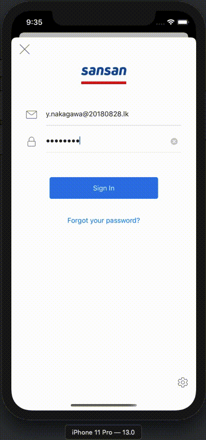

# ログイン時の遷移アニメーションがおかしい

---

### ログイン時の遷移アニメーションがおかしい

- 検証した感じ、セミモーダル上での push 遷移のアニメーションがイケてない
- 出来そうな解決策は 3 つ
  - セミモーダル上でも違和感のない push 遷移用のカスタムアニメーションを作る
  - セミモーダルをやめる (従来通り) :cry:
  - push 遷移のアニメーションを無効にして、セミモーダルの非表示アニメーションを活かす

---

### ログイン時の遷移アニメーションがおかしい

<style scoped>
  section li {
      color: silver;
  }
  section li li:nth-last-child(1) {
      color: black;
  }
  section li li:nth-last-child(2) {
      color: black;
  }
</style>

- 検証した感じ、セミモーダル上での push 遷移のアニメーションがイケてない
- 出来そうな解決策は 3 つ
  - セミモーダル上でも違和感のない push 遷移用のカスタムアニメーションを作る
  - セミモーダルをやめる (従来通り) :cry:
  - push 遷移のアニメーションを無効にして、セミモーダルの非表示アニメーションを活かす

---

## セミモーダルをやめる (従来通り)

```diff
router.viewController.modalTransitionStyle = .crossDissolve
+ router.viewController.modalPresentationStyle = .fullScreen
```

---

# :tada:

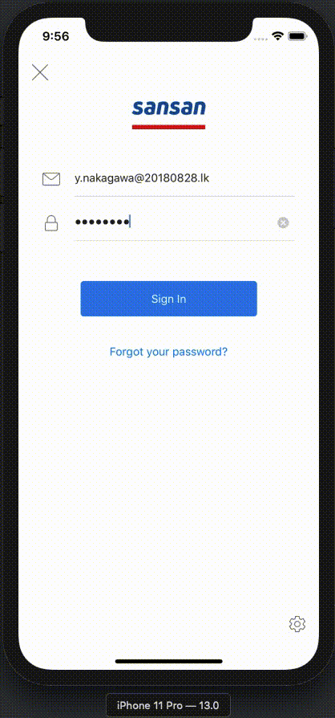

---

<style scoped>
  section pre {
    white-space: pre-wrap;
  }
</style>

##### push 遷移のアニメーションを無効にして、セミモーダルの非表示アニメーションを活かす

```diff
- <segue destination="wVx-Cm-Up9" kind="show" identifier="PushToMainMenu" id="1DV-k7-ezV"/>
+ <segue destination="wVx-Cm-Up9" kind="show" identifier="PushToMainMenu" animates="NO" id="1DV-k7-ezV"/>
```

---

# :tada:

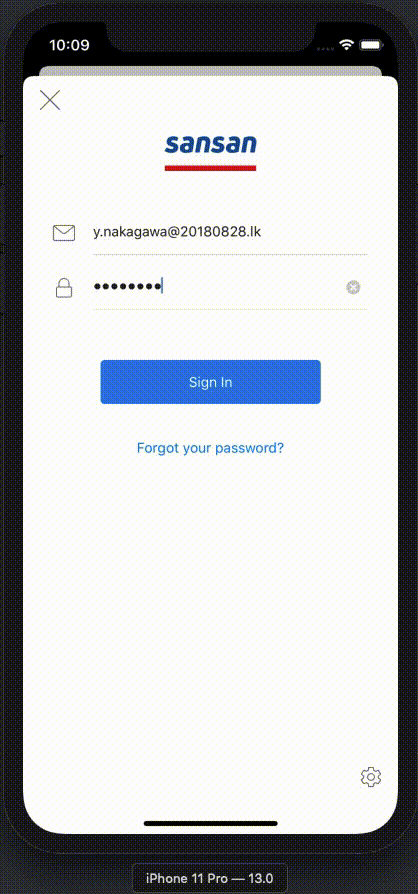

---

#### UINavigationBar.titleView に UISearchBar を設定した場合に制約が効かなくなった

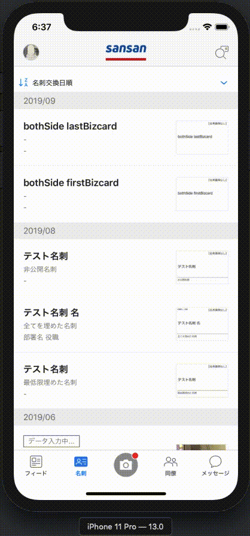

---

<style scoped>
  section pre {
    white-space: pre-wrap;
    font-size: 24px;
  }
</style>

##### UINavigationBar.titleView に UISearchBar を設定した場合に制約が効かなくなった

元々、 iOS 11 で UISearchBar の高さが 56 になり、 UINavigationBar の高さが子ビューに合わせて、 56 になったことに対する対応として、以下のコードがあった

```swift
if #available(iOS 11.0, *) {
    searchBar.heightAnchor.constraint(equalToConstant: 44).isActive = true
}
```

---

##### UINavigationBar.titleView に UISearchBar を設定した場合に制約が効かなくなった

- iOS 12 までは設定した制約が Intrinsic Content Size より優先されていた
- iOS 13 から設定した制約より Intrinsic Content Size が優先されるようになった


---

##### UINavigationBar.titleView に UISearchBar を設定した場合に制約が効かなくなった

<style scoped>
  section li {
    font-size: 35px;
  }
</style>

- 色々、試したが以前と同じく 44 を設定できたのは以下の方法
  - Intrinsic Content Size が設定されていない UIView でラップ
  - UISearchBar の translatesAutoresizingMaskIntoConstraints を false にする
  - UINavigationBar.titleView にはラップした UIView を設定
  - viewDidLayoutSubviews で制約を設定

---

##### UINavigationBar.titleView に UISearchBar を設定した場合に制約が効かなくなった

<style scoped>
  section pre {
    white-space: pre-wrap;
    font-size: 24px;
  }
</style>

```diff
if #available(iOS 11.0, *) {
    searchBar.heightAnchor.constraint(equalToConstant: 44).isActive = true
}
navigationItem.titleView = searchBar
+ if #available(iOS 13.0, *) {
+     searchBar.translatesAutoresizingMaskIntoConstraints = false
+     titleView.addSubview(searchBar)
+     navigationItem.titleView = titleView
+ }
```

続く

---

<style scoped>
  section pre {
    white-space: pre-wrap;
    font-size: 24px;
  }
</style>

```diff
+ override func viewDidLayoutSubviews() {
+     if #available(iOS 13.0, *) {
+         // 各 UI の幅取得は省略 :bow:
+         let titleViewWidth = navigationBarWidth - (leftBarButtonItemWidth + rightBarButtonItemWidth)
+         titleView.widthAnchor.constraint(equalToConstant: titleViewWidth).isActive = true
+         titleView.heightAnchor.constraint(equalTo: searchBar.heightAnchor).isActive = true
+         titleView.centerYAnchor.constraint(equalTo: searchBar.centerYAnchor).isActive = true
+         titleView.leadingAnchor.constraint(equalTo: searchBar.leadingAnchor).isActive = true
+         titleView.trailingAnchor.constraint(equalTo: searchBar.trailingAnchor).isActive = true
+     }
+ 
+     super.viewDidLayoutSubviews()
+ }
```

---

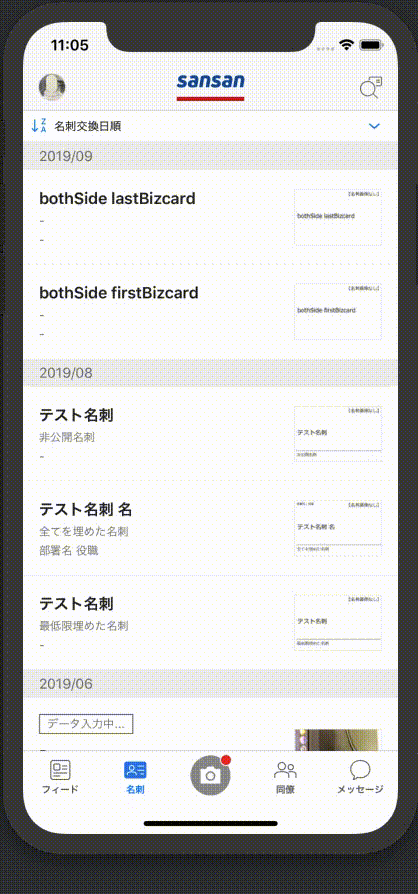

#### UINavigationBar.titleView に UISearchBar を設定した場合に制約が効かなくなった

# :angel: しんどい :angel:

---

# まとめ

---

# まとめ

- iOS 13 SDK でビルドと実行に成功するところまでは以前の iOS 12 SDK のアップデート時とそこまで変わらなかった :+1:
- 実際に iOS 13 SDK でビルドしたアプリを iOS 13 上で動かすと様々な問題が発生した :sob:
  - すべての画面をテストできたわけではないので、まだあるかも… :cold_sweat:

---

# Sansan アプリからの学び

- iOS 13 SDK で変更のあったモーダル遷移をしている箇所とその画面からの遷移先までは一通り確認してみよう
- 個別バージョン対応している箇所は SDK のアップデートの影響で動かなくなるかもしれないので、その部分も確認しよう

---

